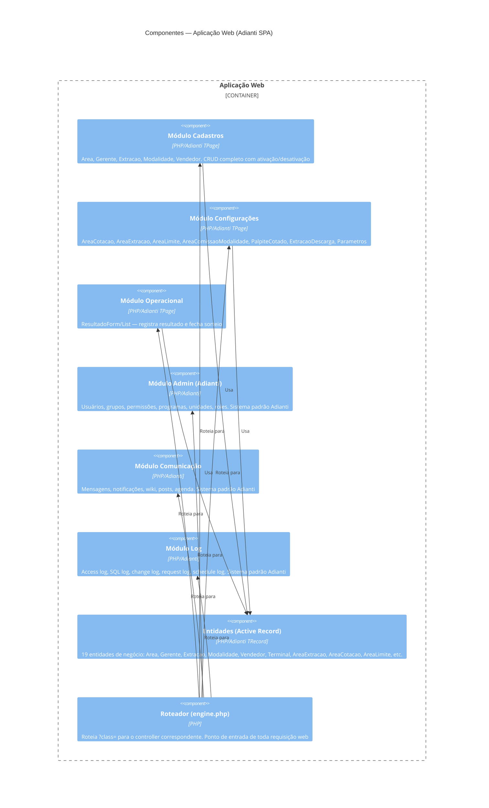
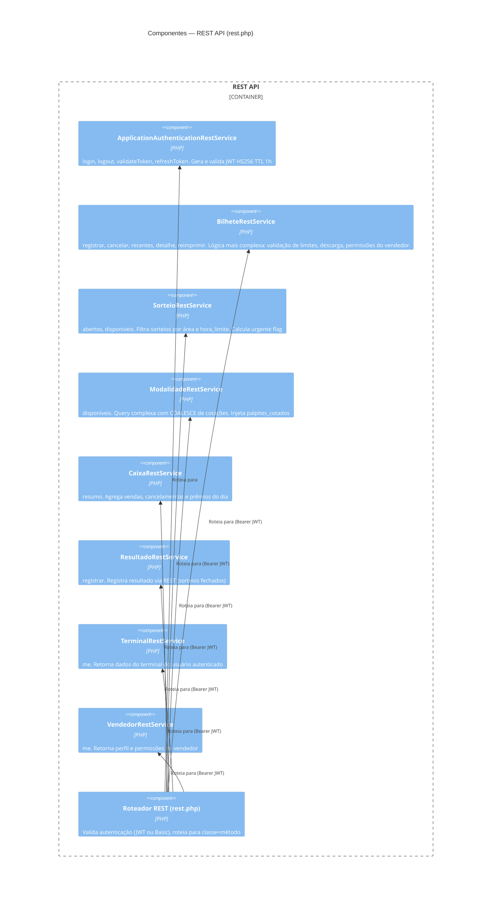
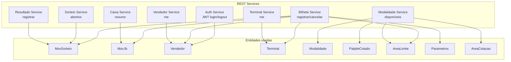

# C4 — Nível 3: Componentes

> Gerado pelo Reversa Architect em 2026-04-30
> Confiança: 🟢 CONFIRMADO

## Container: Aplicação Web

```mermaid
C4Component
    title Componentes — Aplicação Web (Adianti SPA)

    Container_Boundary(web, "Aplicação Web") {
        Component(cadastros, "Módulo Cadastros", "PHP/Adianti TPage", "Area, Gerente, Extracao, Modalidade, Vendedor. CRUD completo com ativação/desativação")
        Component(configuracoes, "Módulo Configurações", "PHP/Adianti TPage", "AreaCotacao, AreaExtracao, AreaLimite, AreaComissaoModalidade, PalpiteCotado, ExtracaoDescarga, Parametros")
        Component(operacional, "Módulo Operacional", "PHP/Adianti TPage", "ResultadoForm/List — registra resultado e fecha sorteio")
        Component(admin_mod, "Módulo Admin (Adianti)", "PHP/Adianti", "Usuários, grupos, permissões, programas, unidades, roles. Sistema padrão Adianti")
        Component(communication, "Módulo Comunicação", "PHP/Adianti", "Mensagens, notificações, wiki, posts, agenda. Sistema padrão Adianti")
        Component(log_mod, "Módulo Log", "PHP/Adianti", "Access log, SQL log, change log, request log, schedule log. Sistema padrão Adianti")
        Component(entities, "Entidades (Active Record)", "PHP/Adianti TRecord", "19 entidades de negócio: Area, Gerente, Extracao, Modalidade, Vendedor, Terminal, AreaExtracao, AreaCotacao, AreaLimite, etc.")
        Component(engine, "Roteador (engine.php)", "PHP", "Roteia ?class= para o controller correspondente. Ponto de entrada de toda requisição web")
    }

    Rel(engine, cadastros, "Roteia para")
    Rel(engine, configuracoes, "Roteia para")
    Rel(engine, operacional, "Roteia para")
    Rel(engine, admin_mod, "Roteia para")
    Rel(engine, communication, "Roteia para")
    Rel(engine, log_mod, "Roteia para")
    Rel(cadastros, entities, "Usa")
    Rel(configuracoes, entities, "Usa")
    Rel(operacional, entities, "Usa")
```

## Container: REST API

```mermaid
C4Component
    title Componentes — REST API (rest.php)

    Container_Boundary(api, "REST API") {
        Component(auth_svc, "ApplicationAuthenticationRestService", "PHP", "login, logout, validateToken, refreshToken. Gera e valida JWT HS256 TTL 1h")
        Component(bilhete_svc, "BilheteRestService", "PHP", "registrar, cancelar, recentes, detalhe, reimprimir. Lógica mais complexa: validação de limites, descarga, permissões do vendedor")
        Component(sorteio_svc, "SorteioRestService", "PHP", "abertos, disponiveis. Filtra sorteios por área e hora_limite. Calcula urgente flag")
        Component(modalidade_svc, "ModalidadeRestService", "PHP", "disponiveis. Query complexa com COALESCE de cotações. Injeta palpites_cotados")
        Component(caixa_svc, "CaixaRestService", "PHP", "resumo. Agrega vendas, cancelamentos e prêmios do dia")
        Component(resultado_svc, "ResultadoRestService", "PHP", "registrar. Registra resultado via REST (sorteios fechados)")
        Component(terminal_svc, "TerminalRestService", "PHP", "me. Retorna dados do terminal do usuário autenticado")
        Component(vendedor_svc, "VendedorRestService", "PHP", "me. Retorna perfil e permissões do vendedor")
        Component(rest_router, "Roteador REST (rest.php)", "PHP", "Valida autenticação (JWT ou Basic), roteia para classe+método")
    }

    Rel(rest_router, auth_svc, "Roteia para")
    Rel(rest_router, bilhete_svc, "Roteia para (Bearer JWT)")
    Rel(rest_router, sorteio_svc, "Roteia para (Bearer JWT)")
    Rel(rest_router, modalidade_svc, "Roteia para (Bearer JWT)")
    Rel(rest_router, caixa_svc, "Roteia para (Bearer JWT)")
    Rel(rest_router, resultado_svc, "Roteia para (Bearer JWT)")
    Rel(rest_router, terminal_svc, "Roteia para (Bearer JWT)")
    Rel(rest_router, vendedor_svc, "Roteia para (Bearer JWT)")
```

## Dependências entre Serviços REST

```mermaid
graph TD
    subgraph "REST Services"
        AUTH[Auth Service\nJWT login/logout]
        BIL[Bilhete Service\nregistrar/cancelar]
        SOR[Sorteio Service\nabertos]
        MOD[Modalidade Service\ndisponíveis]
        CAI[Caixa Service\nresumo]
        RES[Resultado Service\nregistrar]
        TER[Terminal Service\nme]
        VEN[Vendedor Service\nme]
    end

    subgraph "Entidades usadas"
        MV[MovSorteio]
        MJ[MovJb]
        VC[Vendedor]
        TM[Terminal]
        MD[Modalidade]
        PC[PalpiteCotado]
        AL[AreaLimite]
        PM[Parametros]
        AC[AreaCotacao]
    end

    AUTH --> VC
    BIL --> MJ
    BIL --> MV
    BIL --> VC
    BIL --> TM
    BIL --> AL
    BIL --> PM
    SOR --> MV
    MOD --> MD
    MOD --> PC
    MOD --> AC
    MOD --> AL
    CAI --> MJ
    RES --> MV
    TER --> TM
    VEN --> VC
```
