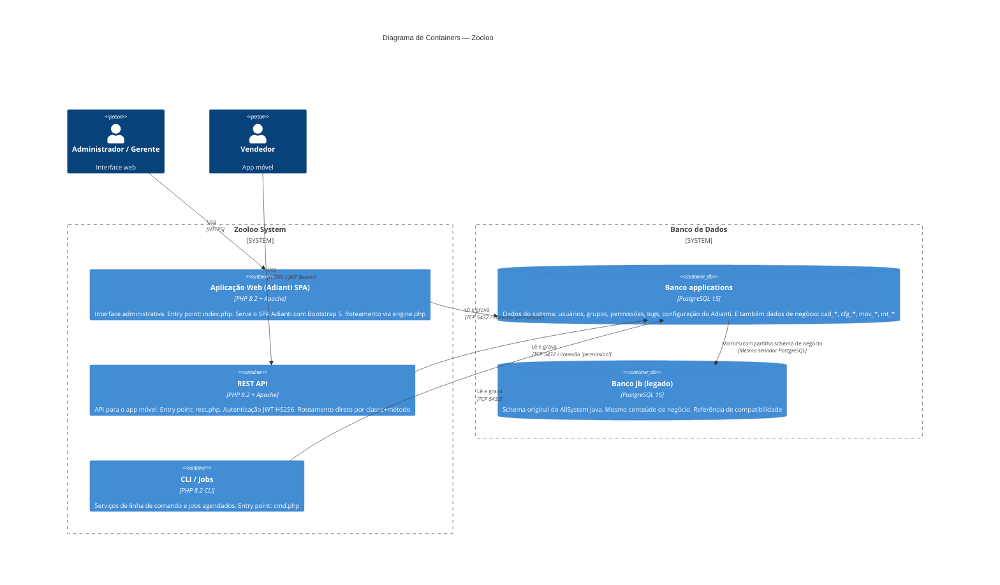

# C4 — Nível 2: Containers

> Gerado pelo Reversa Architect em 2026-04-30
> Confiança: 🟢 CONFIRMADO

## Detalhes dos Containers

### Aplicação Web (index.php → engine.php)

| Aspecto | Detalhe |
|---|---|
| **Tecnologia** | PHP 8.2 + Apache + Adianti Framework 8.1 |
| **Tema** | Bootstrap 5 (`adminbs5`) |
| **Roteamento** | `engine.php` — parâmetro `?class=NomeController` |
| **Sessão** | TSession (PHP Session + Adianti wrapper) |
| **Padrão de tela** | TPage com BootstrapFormBuilder / BootstrapDatagridWrapper |

### REST API (rest.php)

| Aspecto | Detalhe |
|---|---|
| **Tecnologia** | PHP 8.2 + Apache |
| **Roteamento** | `?class=NomeService&method=nomeMetodo` |
| **Autenticação** | Bearer JWT (HS256, TTL 1h) ou Basic (API key) |
| **Formato** | JSON (request e response) |
| **Base URL** | `http://localhost/rest.php` |

### CLI (cmd.php)

| Aspecto | Detalhe |
|---|---|
| **Tecnologia** | PHP 8.2 CLI |
| **Uso** | Jobs agendados, utilitários de manutenção |
| **Serviços** | `app/service/cli/` e `app/service/jobs/` |

### Banco applications

| Aspecto | Detalhe |
|---|---|
| **Prefixo system_*** | Tabelas do Adianti (usuários, grupos, permissões, programas, logs) |
| **Prefixo cad_*** | Cadastros de negócio |
| **Prefixo cfg_*** | Configurações de negócio |
| **Prefixo mov_*** | Movimentações (bilhetes, sorteios) |
| **Prefixo int_*** | Dados internos/seed (jogos, cálculos) |
| **Conexão PHP** | Nome `'permission'` em TTransaction::open() |
