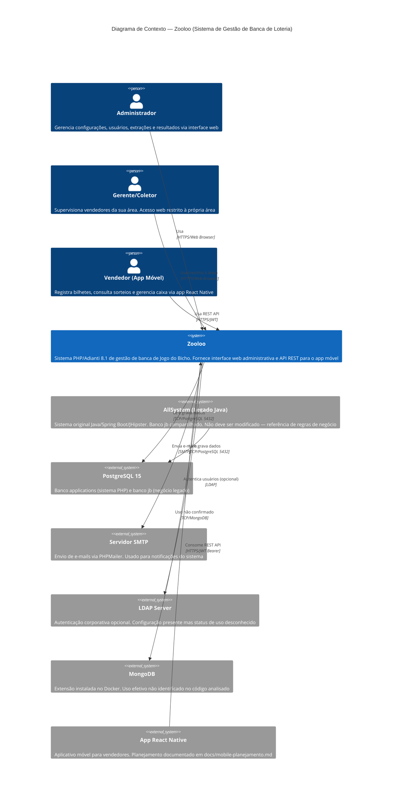

# C4 — Nível 1: Contexto do Sistema

> Gerado pelo Reversa Architect em 2026-04-30
> Confiança: 🟢 CONFIRMADO

## Personas

| Persona | Acesso | Restrições |
|---|---|---|
| **Administrador** | Interface web completa | Nenhuma |
| **Gerente/Coletor** | Interface web parcial | Restrito à própria área |
| **Vendedor** | App móvel (REST API) | Terminal vinculado, permissões granulares |
| **App React Native** | REST API `/rest.php` | JWT Bearer obrigatório |

## Sistemas Externos

| Sistema | Integração | Status |
|---|---|---|
| AllSystem (Java) | Banco `jb` compartilhado | 🟢 Ativo (banco compartilhado) |
| PostgreSQL 15 | Banco principal | 🟢 Ativo |
| PHPMailer/SMTP | Envio de e-mails | 🟢 Instalado |
| LDAP | Autenticação alternativa | 🟡 Configurado, uso incerto |
| MongoDB | Armazenamento alternativo | 🔴 Lacuna — instalado, sem uso confirmado |
| React Native | App móvel vendedor | 🟡 Em planejamento |
