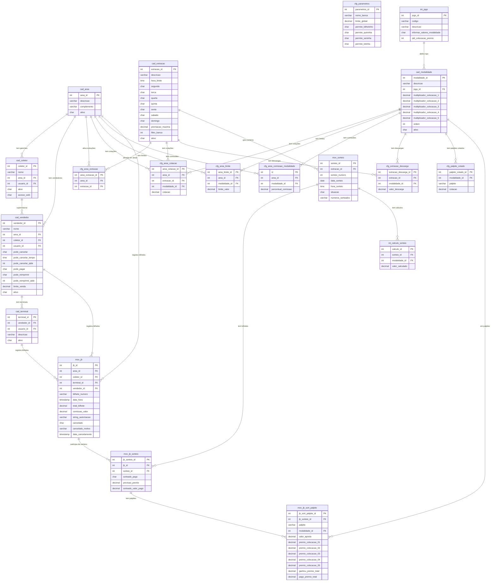

# ERD Completo — zooloo

> Gerado pelo Reversa Architect em 2026-04-30
> Confiança: 🟢 CONFIRMADO | 🟡 INFERIDO

---

## Diagrama de Entidade-Relacionamento

---

## Tabela de Cardinalidades

| Relação | Tipo | Observação |
|---|---|---|
| Area → Gerente | 1:N | Uma área tem vários gerentes |
| Area → Vendedor | 1:N | Uma área tem vários vendedores |
| Gerente → Vendedor | 1:N | Um gerente supervisiona vários vendedores |
| Extracao → Sorteio | 1:N | Uma extração gera múltiplos sorteios (um por ocorrência) |
| Area × Extracao | N:M | Via `cfg_area_extracao` (sem campo ativo — presença = ativo) |
| Area × Modalidade | N:M via cfg_area_cotacao | Cotação específica por área+extração+modalidade |
| Vendedor → Terminal | 1:N | Um vendedor pode ter vários terminais (app) |
| MovJb → MovSorteio | N:M via mov_jb_sorteio | Bilhete pode participar de múltiplos sorteios |
| IntJogo → Modalidade | 1:1 | Cada tipo de jogo tem apenas uma modalidade |

> **🔴 Lacuna:** `cfg_extracao_modalidade` referenciada em `ModalidadeRestService` sem Active Record identificado — pode existir no banco sem entidade PHP mapeada.
