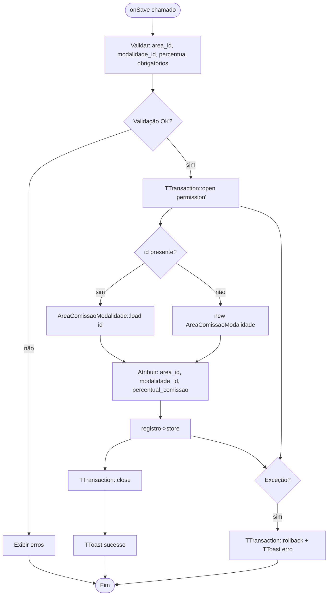

# Fluxograma — Módulo AreaComissaoModalidade

> Gerado pelo Reversa Archaeologist em 2026-04-30
> Confiança: 🟢 CONFIRMADO

## AreaComissaoModalidadeForm — Salvar



## AreaComissaoModalidadeList — Grid com Área e Modalidade

```mermaid
flowchart TD
    A([onReload]) --> B[Obter filtros: area_id, modalidade_id]
    B --> C[TTransaction::open 'permission']
    C --> D[JOIN cfg_area_comissao_modalidade + cad_area + cad_modalidade]
    D --> E[Aplicar filtros opcionais]
    E --> F[Renderizar: Área | Modalidade | % Comissão]
    F --> G[TTransaction::close]
    G --> H([Fim])
```

> **Semântica:** Define o percentual de comissão do vendedor sobre apostas de uma modalidade específica em uma área. Tabela de configuração fina — permite distinção de comissão por tipo de jogo e zona geográfica.
> **Tabela:** `cfg_area_comissao_modalidade` — chave composta (area_id + modalidade_id).
