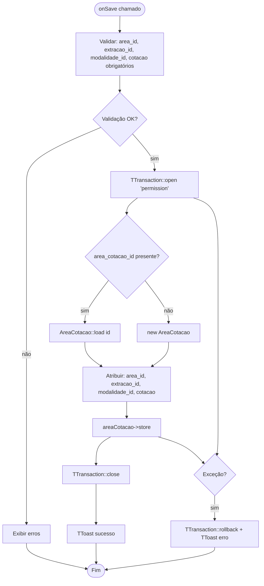
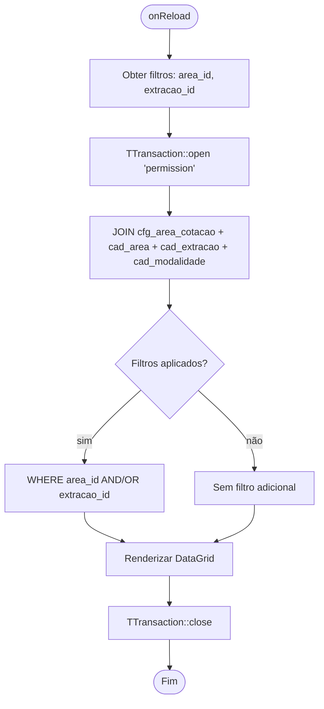

# Fluxograma — Módulo AreaCotacao

> Gerado pelo Reversa Archaeologist em 2026-04-30
> Confiança: 🟢 CONFIRMADO

## AreaCotacaoForm — Salvar

## AreaCotacaoList — Filtrar por Área e Extração

> **Semântica:** A cotação é o multiplicador de premiação. Se um bilhete de R$1 acertar na Milhar com cotação 4000, o prêmio é R$4.000.
> **Relação:** cfg_area_cotacao tem chave composta (area_id + extracao_id + modalidade_id). Overrides podem existir por área específica.
