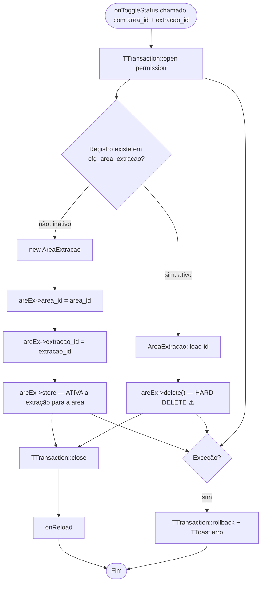
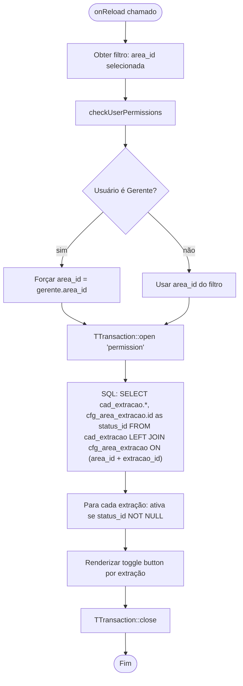

# Fluxograma — Módulo AreaExtracao

> Gerado pelo Reversa Archaeologist em 2026-04-30
> Confiança: 🟢 CONFIRMADO

## AreaExtracaoList — Toggle de Status (Ativar/Desativar)

## AreaExtracaoList — Carregar Grid (SQL complexo)

> **Padrão de ativação:** Ao contrário de outros módulos (que usam campo `ativo`), AreaExtracao usa presença/ausência de registro como estado — `INSERT` para ativar, `DELETE` para desativar.
> **Isolamento de Gerente:** Gerentes só veem/editam extrações da própria área.
