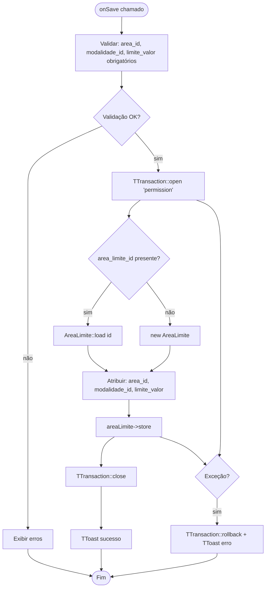

# Fluxograma — Módulo AreaLimite

> Gerado pelo Reversa Archaeologist em 2026-04-30
> Confiança: 🟢 CONFIRMADO

## AreaLimiteForm — Salvar



## AreaLimiteList — Renderização com Área e Modalidade

```mermaid
flowchart TD
    A([onReload]) --> B[Obter filtros: area_id, modalidade_id]
    B --> C[TTransaction::open 'permission']
    C --> D[JOIN cfg_area_limite + cad_area + cad_modalidade]
    D --> E[Filtros opcionais por area_id e/ou modalidade_id]
    E --> F[Renderizar DataGrid: Área | Modalidade | Limite]
    F --> G[TTransaction::close]
    G --> H([Fim])
```

> **Semântica:** O `limite_valor` define o valor máximo em reais que pode ser apostado por palpite em uma determinada combinação área+modalidade. Usado no BilheteRestService via COALESCE (limite da área ou limite global).
> **Relacionamento com BilheteRestService:** `COALESCE(cfg_area_limite.limite_valor, cfg_parametros.limite_global)` — o limite da área tem precedência.
