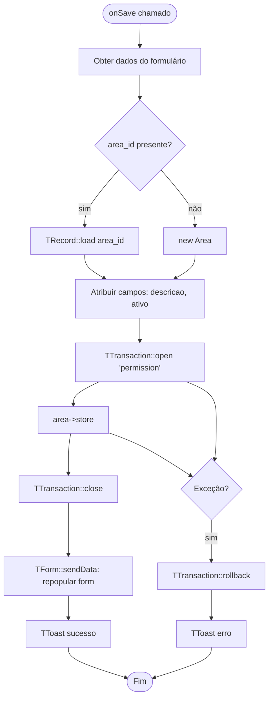
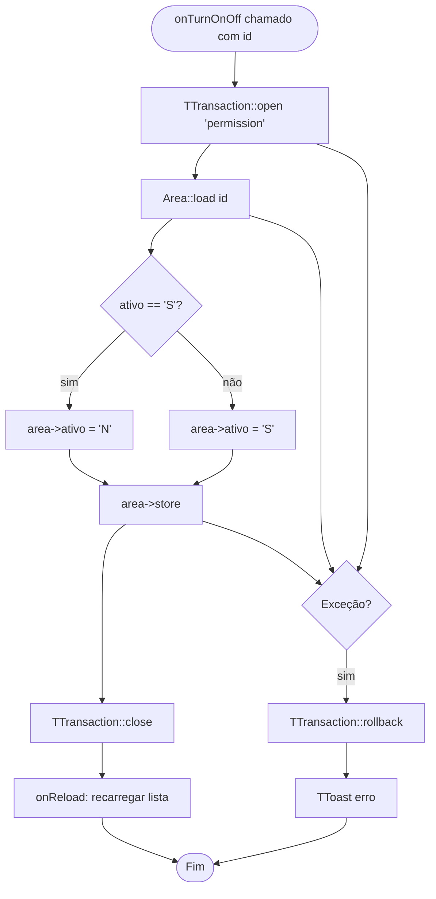
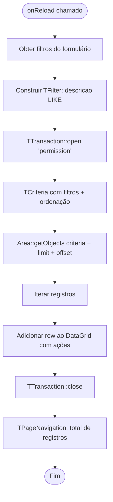

# Fluxograma — Módulo Area

> Gerado pelo Reversa Archaeologist em 2026-04-30
> Confiança: 🟢 CONFIRMADO

## AreaForm — Salvar

```mermaid
flowchart TD
    A([onSave chamado]) --> B[Obter dados do formulário]
    B --> C{area_id presente?}
    C -- sim --> D[TRecord::load area_id]
    C -- não --> E[new Area]
    D --> F[Atribuir campos: descricao, ativo]
    E --> F
    F --> G[TTransaction::open 'permission']
    G --> H[area->store]
    H --> I[TTransaction::close]
    I --> J[TForm::sendData: repopular form]
    J --> K[TToast sucesso]
    K --> L([Fim])
    G --> M{Exceção?}
    H --> M
    M -- sim --> N[TTransaction::rollback]
    N --> O[TToast erro]
    O --> L
```

## AreaList — Toggle Ativo

```mermaid
flowchart TD
    A([onTurnOnOff chamado com id]) --> B[TTransaction::open 'permission']
    B --> C[Area::load id]
    C --> D{ativo == 'S'?}
    D -- sim --> E[area->ativo = 'N']
    D -- não --> F[area->ativo = 'S']
    E --> G[area->store]
    F --> G
    G --> H[TTransaction::close]
    H --> I[onReload: recarregar lista]
    I --> J([Fim])
    B --> K{Exceção?}
    C --> K
    G --> K
    K -- sim --> L[TTransaction::rollback]
    L --> M[TToast erro]
    M --> J
```

## AreaList — Filtrar e Paginar

```mermaid
flowchart TD
    A([onReload chamado]) --> B[Obter filtros do formulário]
    B --> C[Construir TFilter: descricao LIKE]
    C --> D[TTransaction::open 'permission']
    D --> E[TCriteria com filtros + ordenação]
    E --> F[Area::getObjects criteria + limit + offset]
    F --> G[Iterar registros]
    G --> H[Adicionar row ao DataGrid com ações]
    H --> I[TTransaction::close]
    I --> J[TPageNavigation: total de registros]
    J --> K([Fim])
```
