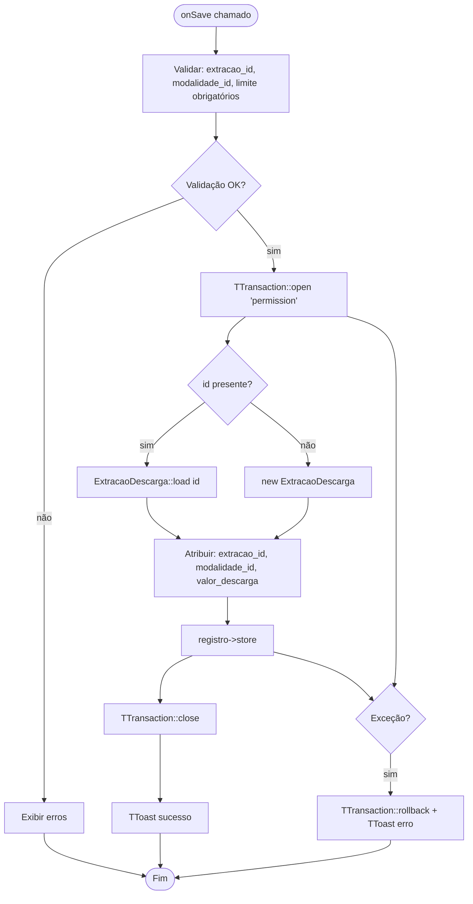

# Fluxograma — Módulo ExtracaoDescarga

> Gerado pelo Reversa Archaeologist em 2026-04-30
> Confiança: 🟢 CONFIRMADO

## ExtracaoDescargaForm — Salvar



## ExtracaoDescargaList — Grid com Extração e Modalidade

```mermaid
flowchart TD
    A([onReload]) --> B[Obter filtros: extracao_id, modalidade_id]
    B --> C[TTransaction::open 'permission']
    C --> D[JOIN cfg_extracao_descarga + cad_extracao + cad_modalidade]
    D --> E[Aplicar filtros opcionais]
    E --> F[Renderizar: Extração | Modalidade | Limite de Descarga]
    F --> G[TTransaction::close]
    G --> H([Fim])
```

> **Semântica (Descarga):** Limite máximo de apostas acumuladas em um número específico por sorteio. Protege a banca de risco financeiro excessivo em números "pesados". Quando o limite é atingido, novas apostas naquele número são recusadas ou redirecionadas.
> **Tabela:** `cfg_extracao_descarga` — chave composta (extracao_id + modalidade_id).
> **Integração:** Verificado em BilheteRestService no momento do registro do bilhete.
