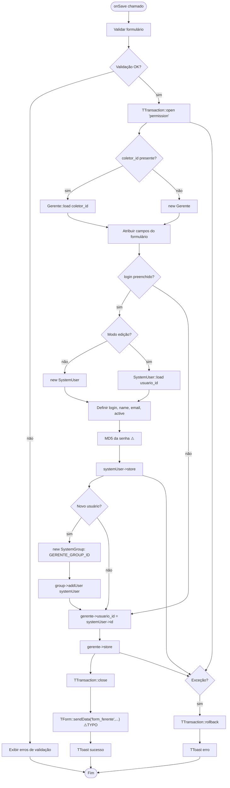
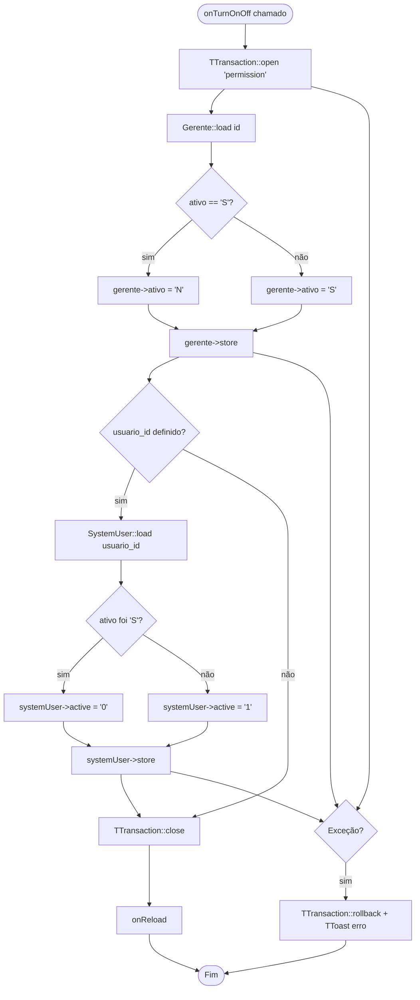

# Fluxograma — Módulo Gerente

> Gerado pelo Reversa Archaeologist em 2026-04-30
> Confiança: 🟢 CONFIRMADO

## GerenteForm — Salvar (criação de Gerente + SystemUser)

## GerenteList — Toggle Ativo (Gerente + SystemUser)

> **Nota:** ⚠️ Bug confirmado em GerenteForm::onSave — `TForm::sendData('form_ferente'...)` deveria ser `'form_gerente'`.
> **TODO documentado:** Ao inativar Gerente, inativar o SystemUser correspondente (parcialmente implementado no List, mas não no Form).
