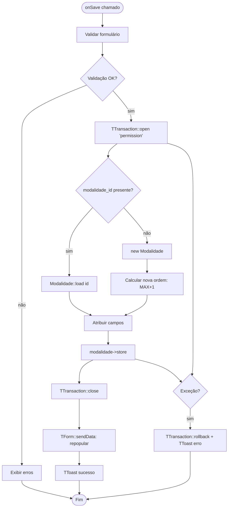
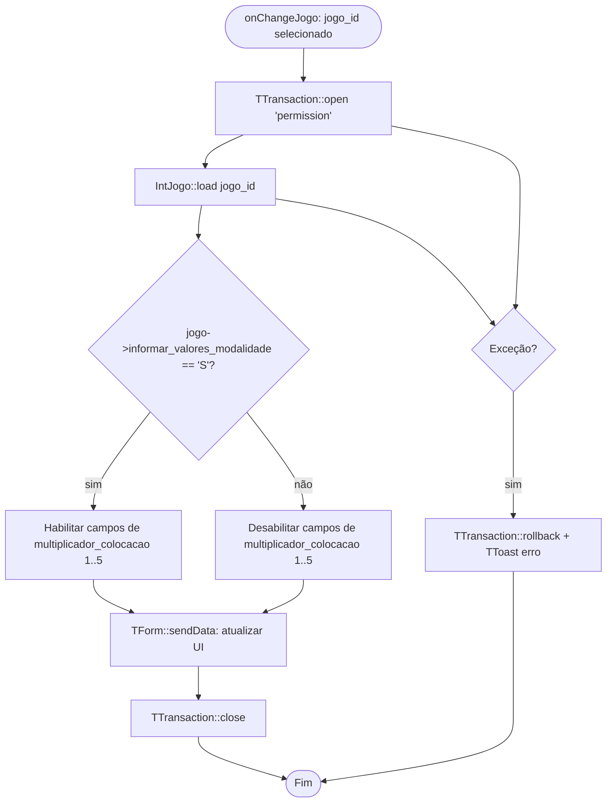
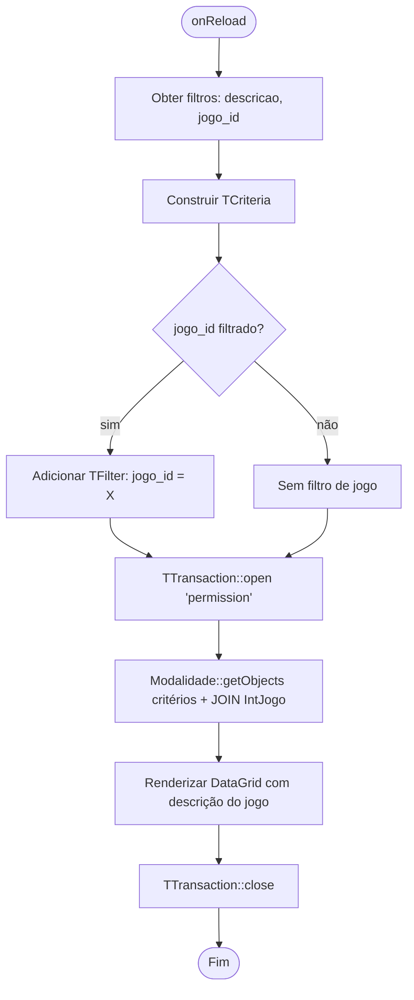

# Fluxograma — Módulo Modalidade

> Gerado pelo Reversa Archaeologist em 2026-04-30
> Confiança: 🟢 CONFIRMADO

## ModalidadeForm — Salvar

## ModalidadeForm — onChangeJogo (Callback AJAX)

## ModalidadeList — Filtrar por Jogo

> **Regra de negócio:** Cada tipo de jogo (`int_jogo`) permite apenas uma modalidade. O combo de jogo no form exclui jogos já usados (`NOT IN cad_modalidade`) para registros novos.
> **Constantes de modalidade ID:** MILHAR_INSTANTANEA=22, MILHAR_MOTO_01=34, _02=35, _03=36 — usadas em BilheteRestService para regras especiais.
