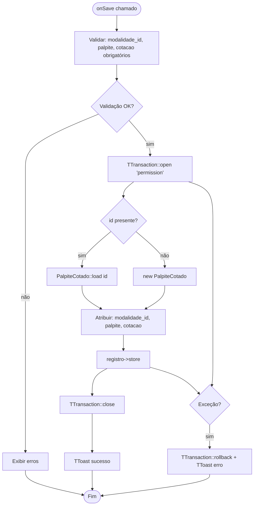
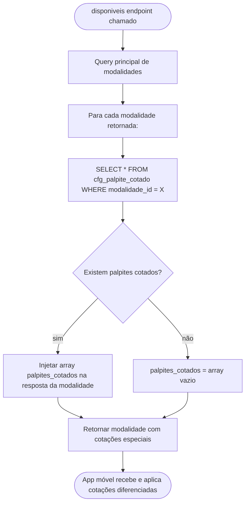

# Fluxograma — Módulo PalpiteCotado

> Gerado pelo Reversa Archaeologist em 2026-04-30
> Confiança: 🟢 CONFIRMADO

## PalpiteCotadoForm — Salvar



## PalpiteCotadoList — Grid com Modalidade

```mermaid
flowchart TD
    A([onReload]) --> B[Obter filtros: modalidade_id, palpite]
    B --> C[TTransaction::open 'permission']
    C --> D[JOIN cfg_palpite_cotado + cad_modalidade]
    D --> E[Aplicar filtros opcionais]
    E --> F[Renderizar: Modalidade | Palpite | Cotação Especial]
    F --> G[TTransaction::close]
    G --> H([Fim])
```

## Integração com ModalidadeRestService



> **Semântica:** Permite definir cotação especial para números específicos — por exemplo, "bicho boi (palpite 01) paga 10x" enquanto o padrão é 6x. Usado para atrair apostas em números "leves".
> **Tabela:** `cfg_palpite_cotado` — combinação (modalidade_id + palpite).
