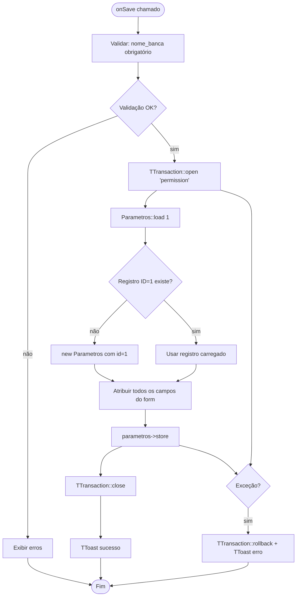
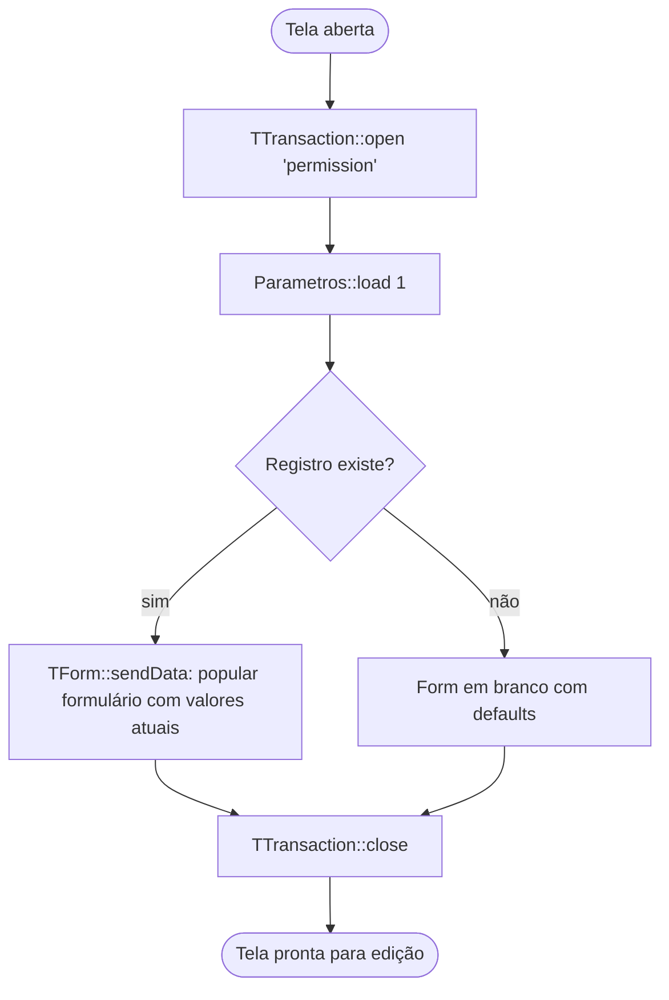

# Fluxograma — Módulo Parametros

> Gerado pelo Reversa Archaeologist em 2026-04-30
> Confiança: 🟢 CONFIRMADO

## ParametrosForm — Salvar (singleton)

## ParametrosForm — onEdit (carregamento automático)

> **Padrão Singleton:** A tabela `cfg_parametros` sempre tem exatamente um registro com ID=1. Nunca há listagem nem criação de múltiplos registros.
> **Campos chave:** `nome_banca` (nome do estabelecimento), `limite_global` (fallback de limite de apostas quando não há cfg_area_limite), flags de features habilitadas (permite_bilhetinho, permite_quininha, etc.).
> **Uso em BilheteRestService:** `cfg_parametros.limite_global` é usado como fallback via COALESCE quando não existe cfg_area_limite para a combinação área+modalidade.
