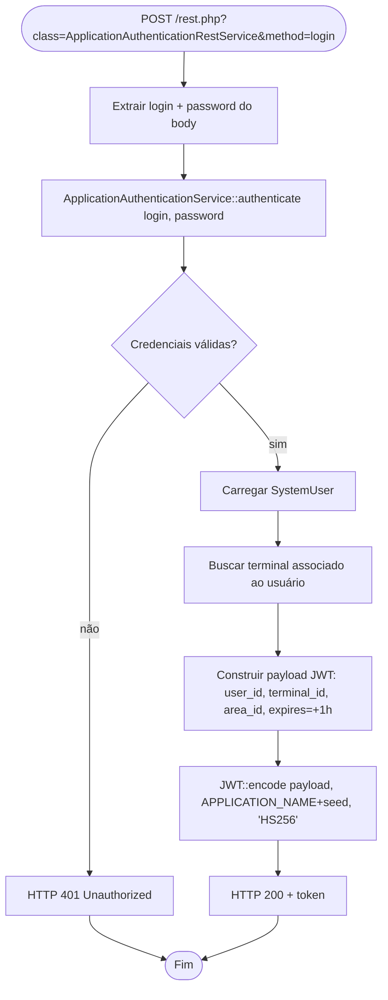
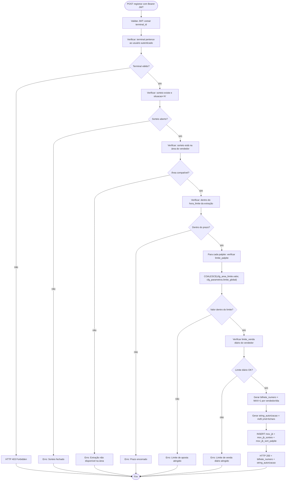
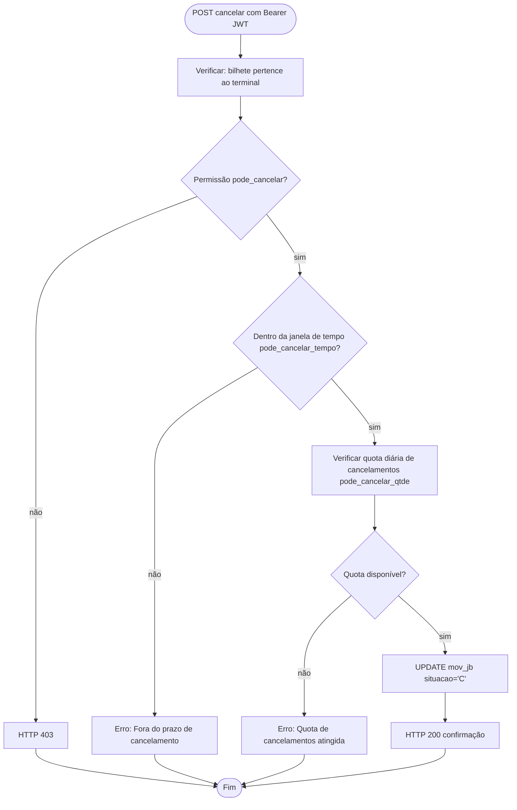
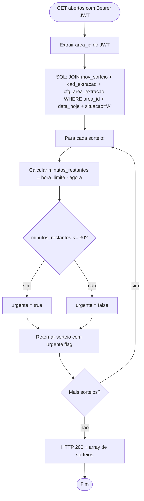
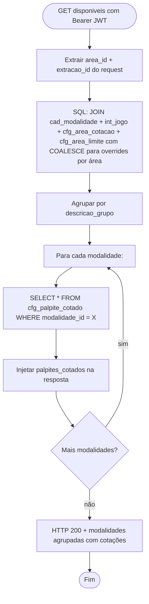

# Fluxograma — Módulo REST API

> Gerado pelo Reversa Archaeologist em 2026-04-30
> Confiança: 🟢 CONFIRMADO

## Autenticação — Login JWT



## BilheteRestService — Registrar Bilhete



## BilheteRestService — Cancelar Bilhete



## SorteioRestService — Abertos por Área



## ModalidadeRestService — Disponíveis por Área



---

## Triggers de Banco — mov_jb e mov_jb_sorteio

> Confirmado pela consulta direta ao banco `jb` em 2026-05-01 🟢

Quatro triggers BEFORE INSERT executam automaticamente ao registrar um bilhete:

```
INSERT mov_jb
    └── trg_mv_jb (BEFORE INSERT)
            └── func_trg_mv_jb_datahora()
                    └── SET new.data_hora_servidor = now()

INSERT mov_jb_sorteio
    ├── trg_mv_jb_sorteio_comissao (BEFORE INSERT)
    │       └── func_trg_mv_jb_sorteio_comissao()
    │               Hierarquia de comissão (cfg_vendedor_mod_comissao):
    │               1. global área (area_id, modalidade_id=NULL, vendedor_id=NULL)
    │               2. área + modalidade (modalidade_id, vendedor_id=NULL)
    │               3. modalidade global (area_id=NULL, vendedor_id=NULL)
    │               4. área + vendedor (modalidade_id=NULL)
    │               5. área + modalidade + vendedor (mais específico)
    │               6. fallback: cad_vendedor.comissao
    │               SET new.comissao_sorteio = (varcomissao/100) * new.total_sorteio
    │               UPDATE mov_jb SET comissao_valor += new.comissao_sorteio
    │
    ├── trg_mv_jb_sorteio_previsao (BEFORE INSERT)
    │       └── func_trg_mov_jb_sorteio_previsao()
    │               Calcula previsao_premio por jogo_id:
    │               - Milhar Invertida (3): usa cotação milhar
    │               - Milhar+Centena (9,10): soma cotações
    │               - Centena+Dezena (19): soma cotações
    │               - Milhar+Centena+Dezena (18): soma cotações
    │               - Centena Invertida (5): usa cotação centena
    │               - Bilhetinho/Quininha/Seninha (1,25,27): multiplicadorColocacao01
    │               - Milhar Brinde (20): vlr_palpite=1
    │               SET new.previsao_premio = mtpc_modalidade * vlr_palpite
    │
    └── trg_mv_jb_sorteio_instantaneo (BEFORE INSERT)
            └── func_trg_mov_jb_sorteio_instantaneo()
                    Para jogo_abrev='MINST' (Milhar Instantânea):
                    INSERT mov_sorteio com situacao='F' imediatamente (sorteio instantâneo)
                    UPDATE mov_jb.sorteios_ids = novo sorteio_id
```

> **Endpoint base:** `http://localhost/rest.php`
> **Autenticação:** Bearer JWT (HS256, TTL 1h) ou Basic (API key estática `zooloo_api_key_2025`)
> **Lacuna 🔴:** `cfg_extracao_modalidade` referenciada em ModalidadeRestService sem Active Record correspondente.
