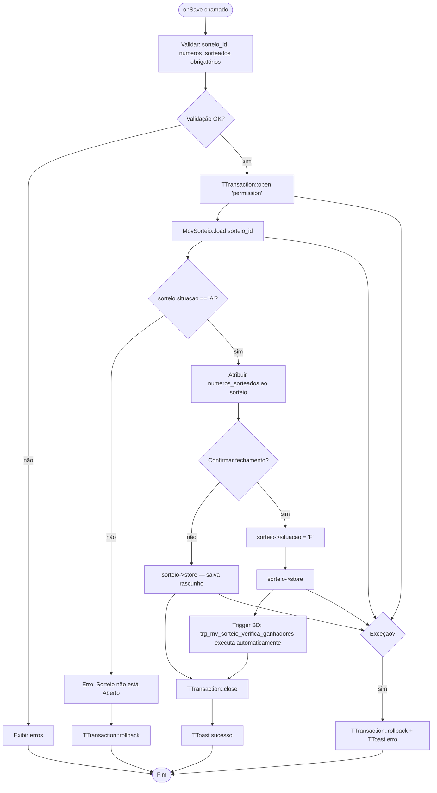
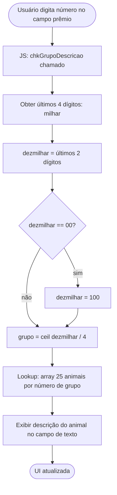
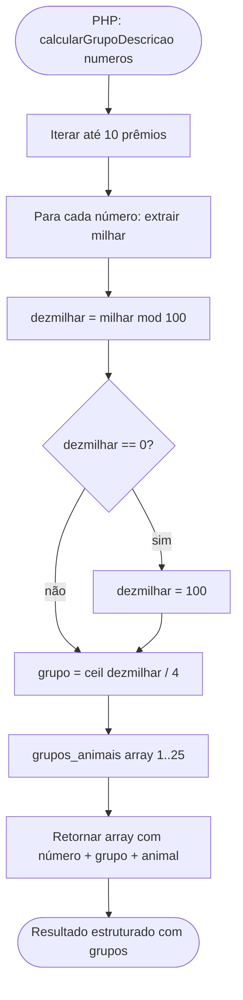

# Fluxograma — Módulo Resultado

> Gerado pelo Reversa Archaeologist em 2026-04-30
> Confiança: 🟢 CONFIRMADO

## ResultadoForm — Salvar Resultado



## ResultadoForm — Cálculo de Grupo (JavaScript + PHP)





## ResultadoList — Filtrar Sorteios por Data/Extração

```mermaid
flowchart TD
    A([onReload]) --> B[Filtros: data_sorteio, extracao_id, situacao]
    B --> C[TTransaction::open 'permission']
    C --> D[JOIN mov_sorteio + cad_extracao]
    D --> E[Filtros opcionais]
    E --> F[Ordenar: data DESC + hora_limite DESC]
    F --> G[Renderizar DataGrid: Data | Extração | Situação | Números]
    G --> H[Botão Editar só para situacao='A']
    H --> I[TTransaction::close]
    I --> J([Fim])
```

> **Trigger automático:** Ao setar `situacao='F'`, o banco executa `trg_mv_sorteio_verifica_ganhadores` que calcula todos os bilhetes premiados. O PHP não precisa fazer essa lógica.
> **Múltiplas triggers:** Uma para JB padrão, uma para Lotinha, uma para Quininha/Seninha.
> **25 grupos Jogo do Bicho:** Avestruz(1), Borboleta(2), ..., Vaca(25). Algoritmo: `ceil(dezmilhar/4)`, onde `dezmilhar = últimos 2 dígitos` e `00 → 100`.
