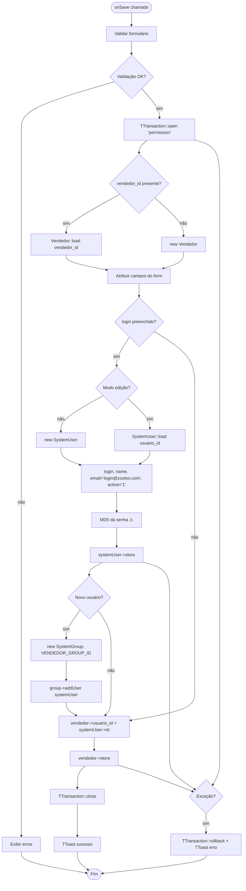
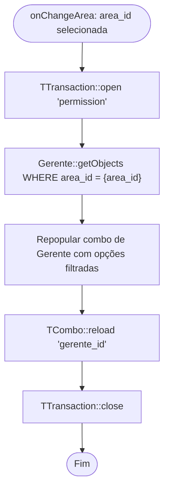
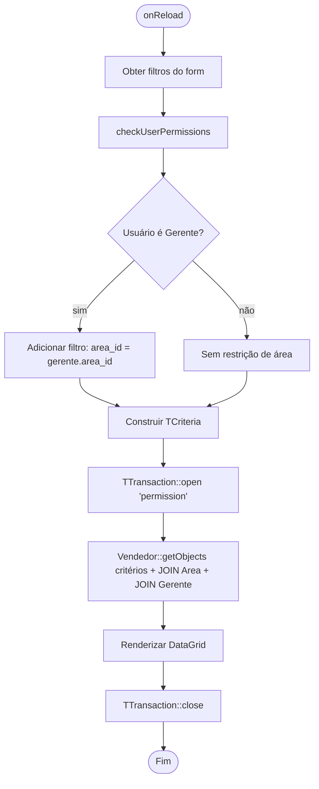

# Fluxograma — Módulo Vendedor

> Gerado pelo Reversa Archaeologist em 2026-04-30
> Confiança: 🟢 CONFIRMADO

## VendedorForm — Salvar (criação de Vendedor + SystemUser)

## VendedorForm — onChangeArea (Callback AJAX)

## VendedorList — onReload com filtros de permissão

> **Padrão igual ao Gerente:** cria SystemUser + adiciona ao grupo VENDEDOR_GROUP_ID em uma única transação.
> **Email fabricado:** `login@zooloo.com` — não é um email real do vendedor.
> **Segurança:** Senha armazenada como MD5 (sem salt) — 🔴 vulnerabilidade conhecida.
