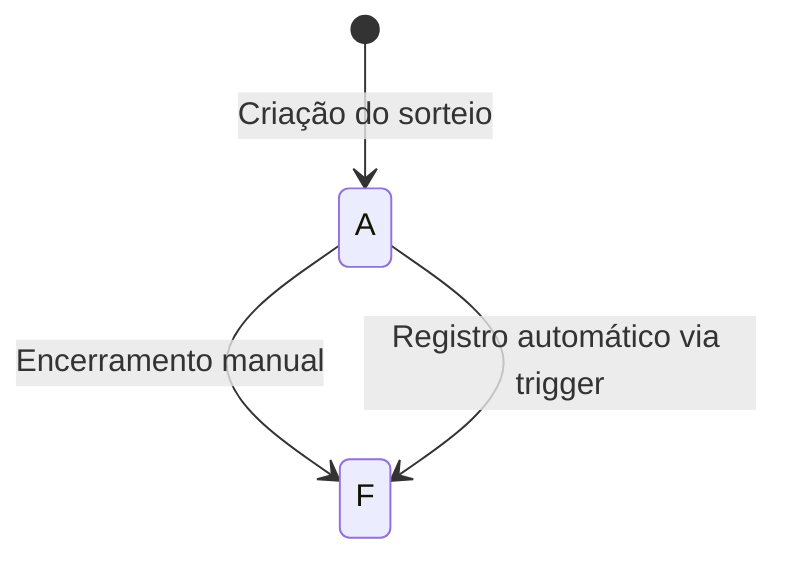

# Máquinas de Estado - Zooloo

## Entidade: Sorteio (mov_sorteio)

### Estados Possíveis
- **A** - Aberto: Sorteio disponível para apostas
- **F** - Fechado: Sorteio encerrado, com resultados já registrados

### Transições de Estado

### Descrição das Transições
1. **Criação do Sorteio**: Um sorteio inicia no estado "A" (Aberto) quando criado automaticamente pelo sistema ou manualmente.
2. **Encerramento Manual**: Um usuário com permissão pode encerrar manualmente um sorteio, mudando seu estado de "A" para "F".
3. **Registro Automático**: Ao registrar os números sorteados, o sistema pode automaticamente encerrar o sorteio, mudando seu estado para "F" através de triggers no banco de dados.

## Entidade: Gerente (cad_coletor) e Vendedor (cad_vendedor)

### Estados Possíveis
- **S** - Ativo
- **N** - Inativo

### Transições de Estado
1. **Ativação/Desativação de Gerente**: Quando um gerente é ativado ou desativado, seu status muda entre "S" e "N".
2. **Ativação/Desativação de Vendedor**: Quando um vendedor é ativado ou desativado, seu status muda entre "S" e "N".

### Observações
- Existe um TODO documentado no código que indica que ao deixar um gerente inativo, o usuário do sistema correspondente também deveria ser inativado automaticamente, mas esta funcionalidade ainda não está completamente implementada.

## Entidade: Área (cad_area)

### Estados Possíveis
- **S** - Ativa
- **N** - Inativa

### Transições de Estado
1. **Ativação/Desativação de Área**: Ao alternar o status de uma área entre ativa ("S") e inativa ("N").

## Entidade: Terminal (cad_terminal)

### Estados Possíveis
- **S** - Ativo
- **N** - Inativo

### Transições de Estado
1. **Ativação/Desativação de Terminal**: Ao alternar o status de um terminal entre ativo ("S") e inativo ("N").

## Entidade: Usuário do Sistema (system_users)

### Estados Possíveis
- **1** - Ativo
- **0** - Inativo

### Transições de Estado
1. **Ativação/Desativação de Usuário**: Ao alternar o status de um usuário entre ativo ("1") e inativo ("0").

## Entidade: Extração (cad_extracao)

### Estados Possíveis
- **S** - Ativo
- **N** - Inativo

### Transições de Estado
1. **Ativação/Desativação de Extração**: Ao alternar o status de uma extração entre ativo ("S") e inativo ("N").

## Lacunas e Considerações

### Lacuna Crítica
- Não há uma máquina de estados clara para a entidade Bilhete (mov_jb) e suas dependências, o que seria importante para entender o fluxo completo de um bilhete no sistema.

### Regras de Negócio Implícitas
- A transição de status de gerente para inativo deveria também inativar o usuário do sistema, mas esta regra ainda não está implementada.
- A verificação do horário limite da extração antes de salvar resultados de sorteio é mencionada como um TODO no arquivo CLAUDE.md, indicando que esta validação ainda não está implementada no código.

## Conclusão

O sistema Zooloo possui máquinas de estado bem definidas para as principais entidades, mas há lacunas em algumas regras de negócio que ainda precisam ser implementadas, como a sincronização entre o status do gerente e seu usuário no sistema, e a verificação de horário limite da extração antes de salvar resultados.